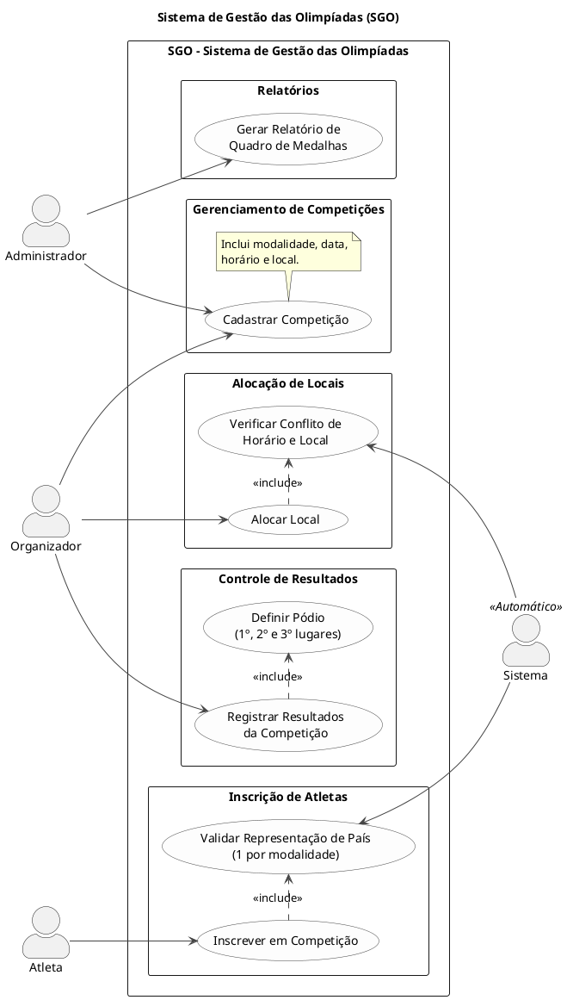
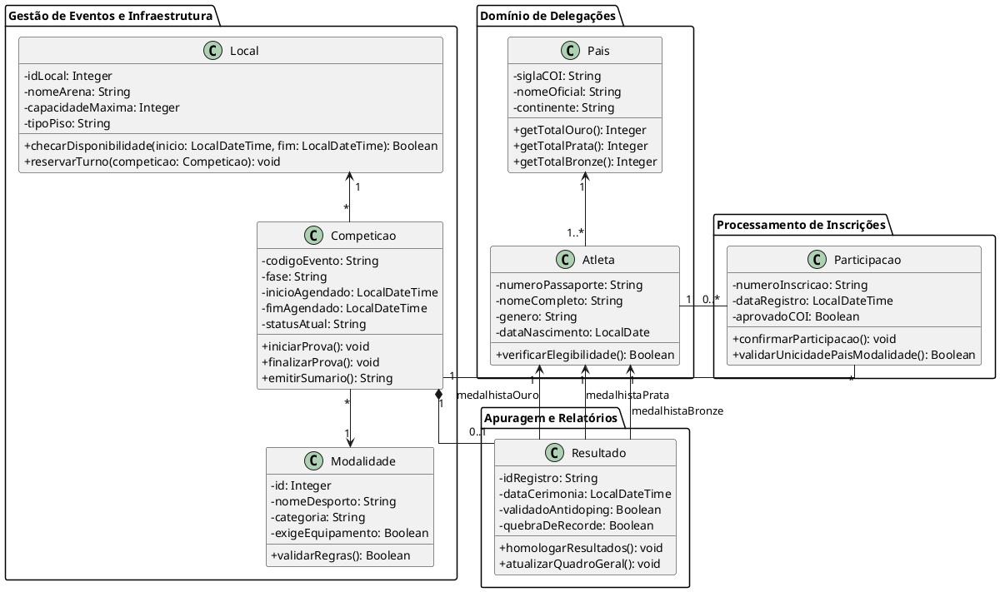
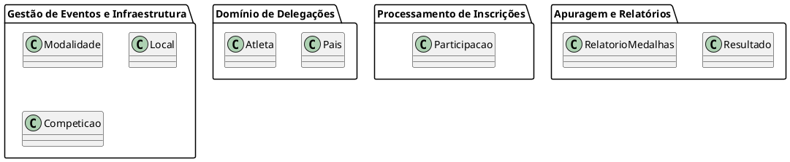
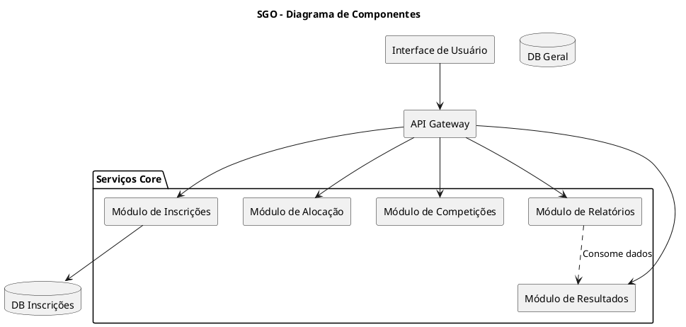
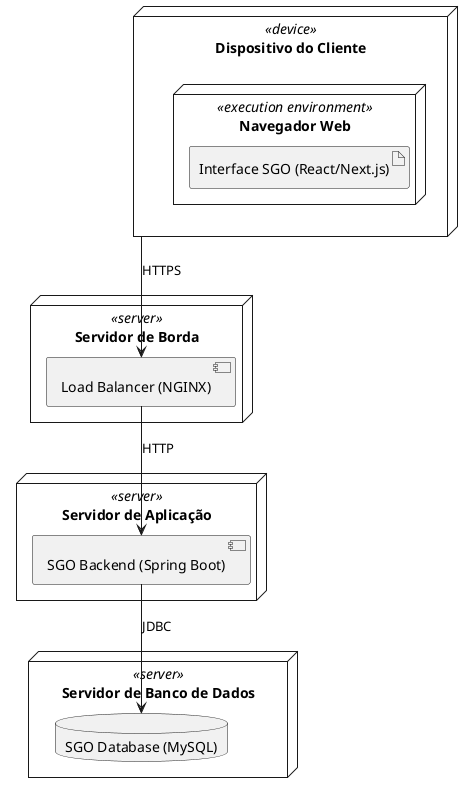

# SGO - Sistema de Gestão das Olimpíadas

## Participantes
* **Davi Nunes Carvalho**
* **Joao Victor Russo Marquito**

## Descrição do Sistema
O Sistema de Gestão das Olimpíadas (SGO) é uma solução robusta para o gerenciamento completo de eventos esportivos de grande escala. O sistema permite o controle de competições, atletas, delegações e infraestrutura, garantindo a integridade dos dados e a fluidez dos processos olímpicos.

### Regras de Negócio Implementadas
1.  **Cadastro de competições**: Permite registrar a modalidade, data, horário, local e gerenciar a lista de atletas inscritos.
2.  **Inscrição de atletas**: Gerencia a participação de atletas de diferentes países, garantindo que cada atleta represente apenas um país por modalidade.
3.  **Alocação de locais**: Sistema de agendamento que evita conflitos de horário, permitindo apenas uma competição por local simultaneamente.
4.  **Controle de resultados**: Registro oficial dos vencedores (ouro, prata e bronze) após o término das competições.
5.  **Relatórios de medalhas**: Geração automática de quadros de medalhas para visualização do desempenho por país.

## Histórias de Usuário (User Stories)
*   **US01**: Como Organizador, quero cadastrar competições (modalidade, data, horário, local) para estruturar o calendário do evento.
*   **US02**: Como Atleta, quero me inscrever em modalidades representando meu país para participar das provas.
*   **US03**: Como Gestor de Infraestrutura, quero alocar locais para as provas garantindo que não haja sobreposição de horários.
*   **US04**: Como Árbitro, quero registrar os resultados oficiais para que o pódio e as medalhas sejam atribuídos corretamente.
*   **US05**: Como Público/Admin, quero visualizar o relatório de medalhas por país para acompanhar o ranking olímpico.

---

## Modelagem UML

### 1. Diagrama de Caso de Uso
Focado nas interações entre os atores (Admin, Organizador, Atleta e Sistema) e os principais serviços do SGO.

**Código PlantUML:**

**Visualização:**

---

### 2. Diagrama de Classes
Representa a estrutura lógica do sistema, atributos, métodos e relacionamentos entre as entidades principais.

**Código PlantUML:**

**Visualização:**

---

### 3. Diagrama de Pacotes
Organização lógica dos módulos do sistema para separação de responsabilidades.

**Código PlantUML:**

**Visualização:**

---

### 4. Diagrama de Componentes
Arquitetura de microsserviços mostrando a interação entre Interface, Gateway e os módulos de negócio.

**Código PlantUML:**

**Visualização:**

---

### 5. Diagrama de Implantação
Representação da infraestrutura física e distribuição dos componentes.

**Código PlantUML:**

**Visualização:**
